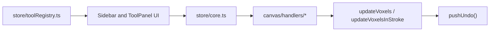
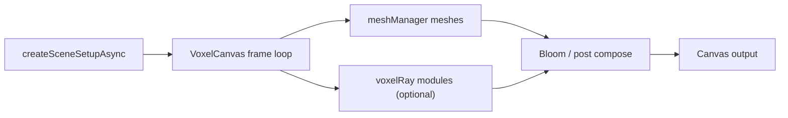

# Voxelle Contributor Guide

This guide explains how to extend Voxelle safely without rediscovering architecture from `VoxelCanvas.svelte`.

## 1) Creating New Tools

Use this checklist when adding a new tool id or behavior.

1. Add metadata in `store/toolRegistry.ts`.
   - Add a `ToolDescriptor` entry with `id`, `category`, `label`, `title`, and `defaultPane`.
   - This powers picker labels and pane routing, but does not wire behavior by itself.

2. Register generator tools in `store/generators/registry.ts` when applicable.
   - Add to `GENERATOR_TOOLS` for generator pane visibility/routing.
   - Add to `GENERATOR_FACE_CLICK_TOOLS` only for pointer-down face-click tools.

3. Extend state/types in `store/core.ts` when the tool needs app-wide state.
   - Add tool ids to unions and lists like `DRAW_TOOLS_USING_STROKE_MODE` if needed.
   - Use `updateVoxels` / `updateVoxelsInStroke` and call `pushUndo()` before edits.

4. Wire pointer behavior.
   - Prefer adding/adjusting focused handlers under `canvas/handlers/`.
   - Keep orchestration in `canvas/pointerOrchestrator.ts` and top-level wiring in `VoxelCanvas.svelte`.

5. Add UI and tool options.
   - Add a panel component under `toolPanel/` (for example, `SquishyOptions.svelte`).
   - Gate visibility in `toolPanel/toolVisibility.ts`.
   - Add sidebar picker entries in `sidebar/` only if the tool should be directly selectable there.

6. Hook preview behavior if the tool needs ghost geometry.
   - Use `meshManager.updatePreviewMesh` patterns from `VoxelCanvas.svelte`.
   - Use section 4 below for preview ownership and geometry flow.

## 2) Rendering Pipeline

Voxelle has one scene/tool pipeline with backend-specific rendering output.

1. Bootstrap and backend selection
   - `canvas/sceneSetup.ts` (`createSceneSetupAsync`) creates scene graph, cameras, controls, renderer, preview containers, and lights.
   - Backend comes from `store/preferences.ts` (`rendererBackend`: `auto`, `webgpu`, `webgl`).

2. Mesh path
   - `canvas/meshManager.ts` owns voxel surface meshes, grid meshes, selection overlays, and preview meshes.
   - Rebuild requests flow through manager callbacks so `VoxelCanvas.svelte` stays mostly orchestration.

3. Bloom/post path
   - WebGL uses `EffectComposer` flow in `VoxelCanvas.svelte`.
   - WebGPU uses offscreen scene render plus `canvas/webgpuBloom.ts` (`RenderPipeline` + `BloomNode`).

4. Ray mode
   - Ray modules live in `canvas/voxelRay*.ts` and `canvas/gpuSoftShadow.ts`.
   - GPU TSL trace is used when supported; progressive CPU path is the fallback.
   - Picking remains CPU voxel-map DDA, even when visual rendering is ray-based.

5. Per-frame orchestration
   - `canvas/voxelCanvasAnimate.ts`: animation step timing and frame progression.
   - `canvas/voxelCanvasBloomRender.ts`: final frame render path and bloom composition.
   - `canvas/voxelCanvasLighting.ts`: lighting and shadow invalidation behavior.

## 3) Greedy Meshing

Greedy meshing is the core surface-generation path for normal rendering and many preview paths.

- Main API lives in `greedyMesh.ts`.
  - `buildGreedyMesh(voxels, options)` returns bucketed geometries keyed by color/material.
  - `PREVIEW_MESH_OPTIONS` provides default preview-oriented meshing settings.
  - `buildPreviewGeometry` and `buildPreviewGeometryFromVoxelMap` generate preview-friendly geometry.

- High-level algorithm
  - Cull non-visible faces.
  - Group by bucket (`color|material`).
  - Merge coplanar quads within each bucket.
  - Apply voxel-corner AO (strength controlled by options).

- Worker/core split
  - Keep heavy meshing logic in `greedyMeshCore.ts` and worker logic modules.
  - Keep thin worker wrappers focused on binding and message plumbing.

- Options and common usage
  - `aoStrength` adjusts AO amount (preview paths often use low/zero AO).
  - `skipMerge` can be used for preview workflows that favor speed or special face behavior.

- Test guardrail
  - Run `greedyMesh.test.ts` for meshing changes.

## 4) Preview System

Previews are not a single feature; there are multiple preview pipelines for different tools.

### Single preview mesh (stroke/generator ghosts)

- `canvas/meshManager.ts` (`updatePreviewMesh`) is the primary entry point.
- Geometry is built with `buildPreviewGeometry` from `greedyMesh.ts`.
- It supports overlap shading against existing voxels and optional preview options (for example, squishy shell edges and grid overlay).

### Add-shape dual preview mesh (visible + occluded)

- `canvas/previewMeshUtils.ts` provides `assignSharedDualPreviewGeometry`.
- `VoxelCanvas.svelte` uses coarse-first previews with follow-up full refinement on larger shapes.
- `previewMeshLod.ts` (`alignPreviewMeshToLod`, `resetPreviewMeshTransform`) keeps downsampled previews aligned to voxel space.

### Selection overlays and bounds previews

- Selection overlays and bbox wireframes are separate from ghost-stroke previews.
- Ownership still sits in `meshManager`, which keeps preview and overlay lifecycles consistent.
- Bounds helpers and thresholds come from modules such as `strokePreviewBounds.ts`.

### Offscreen preview rendering

- `stampBookThumbnail.ts` builds preview mesh geometry with `buildGreedyMesh` + `PREVIEW_MESH_OPTIONS` for stamp thumbnails.

## Related References

- Agent quick guide: `src/routes/voxelle/AGENTS.md`
- Voxelle file format: `src/routes/voxelle/VOXELLE_FORMAT.md`
- User-facing sculpt/tool help: `static/voxelle/HELP.md`
