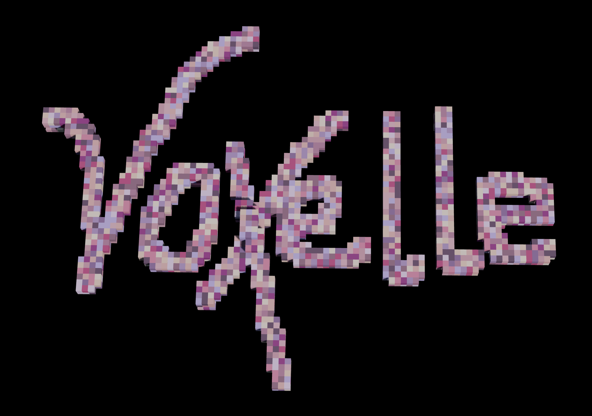

# Voxelle

A 3D voxel sculpting tool. Chip away or add voxels to create sculptures. Runs in the browser with WebGL.

## Features

- Draw, erase, fill, and sculpt voxels in 3D
- Multiple tools: brush, clay, stamps, shapes
- Undo/redo (Ctrl+Z / Ctrl+Shift+Z)
- Export to GLTF
- Save/load `.voxelle` files

## Try it

Visit [this site](https://zeldas.page/voxelle) to use Voxelle.
